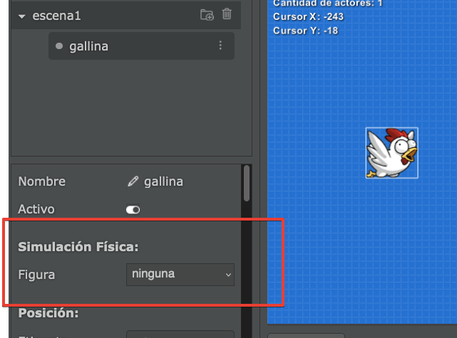
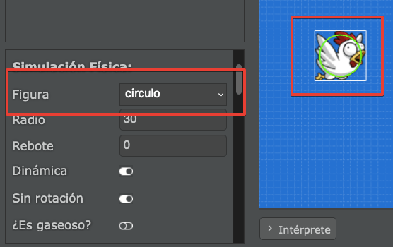
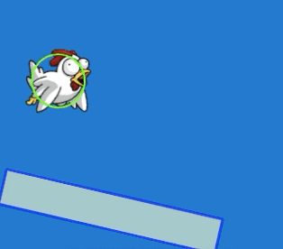
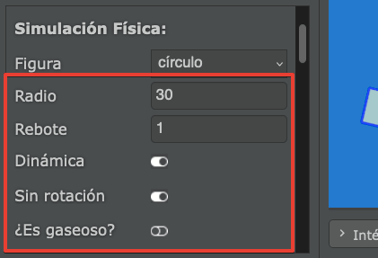
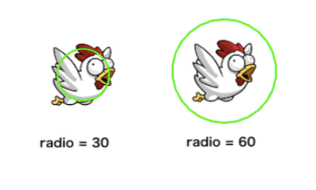
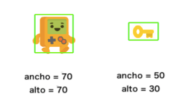
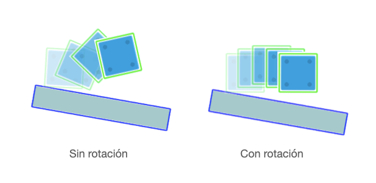

Pilas incluye un motor de física para hacer que los actores
puedan colisionar, rebotar entre sí, ser lanzados y reaccionar
la aceleración gravitatoria del escenario.

Este motor de física tiene muchas variantes, así que vamos
a explorar todas esas oportunidades de configuración en esta
sección.

## Parámetros principales

Para que un actor reaccione a las colisiones o se mueva
como un objeto físico tenemos que activarle una figura desde
las propiedades del actor.

En el panel de propiedades vas a ver una sección llamada
"Simulación Física" y dentro de esa sección una propiedad
llamada "Figura":



Si esa propiedad tiene el valor "ninguna", el actor no podrá
colisionar ni moverse usando el botón de física, para la computadora
será solamente una imagen a mostrar en la pantalla.

Sin embargo, si nosotros cambiamos esa propiedad a "círculo" o "rectángulo"
veremos que el actor tendrá una forma y tamaño en color verde:




Con esta propiedad, el actor va a reaccionar a la física del escenario, por
ejemplo si colocas una plataforma y pulsas el botón ejecutar el actor
comenzará a rebotar así:



También vas a notar que al elegir una figura aparecerán más propiedades
como radio, rebote, dinámica etc...:



### Propiedad Radio

La propiedad `radio` nos indica el tamaño de colisión si el actor
tiene la figura círculo:



Es aconsejable hacer que el tamaño de esta figura coincida con
la imagen del actor, porque la figura física será invisible para
quienes jueguen a tu juego, los jugadores solo van a ver la imagen
del actor.


### Propiedad ancho y alto

Estas propiedades son similares a la propiedad `radio`, pero solo
estarán disponibles si la figura es un `rectángulo`:



Pilas incluye estas figuras porque son las más simples y útiles
de todas, si bien 


### Propiedad rebote

La propiedad `rebote` indicará de qué forma se tiene que
impulsar el actor cuando entre en contacto con otro. Si el valor
de rebote es muy bajo, por ejemplo `0`, el golpe va a hacer
que el objeto se detenga por completo. Mientras que valores como
`1.5` harán que el objeto se impulse con más fuerza.

Ten en cuenta que la reacción del actor dependerá del valor
que tenga la propiedad `rebote` en ambos actores.


### Propiedad Dinámica

La propiedad `dinámica` puede tener los valores `si` y `no`. Una
figura con `dinámica=si` rebotará y se moverá de acuerdo a la
aceleración gravitatoria del escenario.

Si la figura tiene la propiedad `dinamica=no` el actor quedará
rígido sin moverse ni reaccionar a la aceleración gravitatoria. Esto
es ideal para hacer paredes, plataformas u obstáculos del escenario
que no queremos que se muevan por ningún motivo.


### Propiedad Sin rotación

La propiedad `sin_rotacion` sirve para fijar la rotación
de un actor como se muestra en la siguiente imagen:



Esta propiedad es ideal para personajes, ya que no queremos
que ante una colisión aparezcan inclinados.

### Propiedad gaseoso

La propiedad `¿Es gaseoso?` se utiliza para hacer que un
actor se comporte como un fantasma, y que ninguna figura
pueda chocarla o chocar a otros actores.

## Colisiones

Las colisiones permiten ejecutar funciones como respuesta al contacto entre
diferentes actores. Las funciones se pueden personalizar para hacer casi
cualquier cosa: reproducir un sonido para magnificar el impacto, eliminar
alguno de los actores en contacto, emitir efectos etc…

Por ejemplo, imagina que tenemos estos tres actores:


Cuando el juego se ejecute, la plataforma va a quedar fija en pantalla.
Mientras que la pelota y la caja van a moverse hacia abajo y colisionarán.

Pilas va a llamar automáticamente a la función `cuando_comienza_una_colision`
ni bien entren en contacto dos actores. Por ejemplo en este caso, pilas va a
llamar a la función `cuando_comienza_una_colision` cuando la pelota colisione
con la caja, y luego la plataforma.

```javascript
class pelota extends Actor {

  cuando_comienza_una_colision(actor: Actor) {
    if (actor.etiqueta === "caja") {
      return true;
    }

    if (actor.etiqueta === "plataforma") {
      this.decir("Oh, colisioné con una plataforma!");
    }
  }
}
```

En el código hay dos cosas interesantes, tenemos la función
`cuando_comienza_una_colision` dentro de la clase "pelota" para detectar
colisiones y además intentamos distinguir contra qué actores se produce la
colisión usando [etiquetas](etiquetas.md). :

- Si la pelota colisiona con una caja, le indicamos a pilas que ignore la colisión, y continúe. Esto se hace simplemente retornando `true`.
- Si la pelota colisiona con una plataforma, emitimos un mensaje para que el usuario pueda reconocer que la pelota detectó la colisión.

## Tipos de colisiones

Hay 3 instantes muy importantes cuando se producen colisiones:

- Cuando se detecta el contacto inicial.
- Cuando los dos actores permanecen en contacto prolongado. Por ejemplo cuando un actor se posa sobre una plataforma.
- El instante en donde la colisión desaparece porque los actores dejan de estar en contacto. Por ejemplo cuando un actor posando sobre una plataforma "salta" y deja de estar en contacto.

Para distinguir estos casos pilas llamará a las tres funciones de forma diferente. Este es un ejemplo de cómo se declaran esas funciones en el código de un actor:

```typescript
class mi_actor extends Actor {
  cuando_comienza_una_colision(actor: Actor) {
    if (actor.etiqueta === "moneda") {
      this.pilas.reproducir_sonido("moneda");
      actor.eliminar();
    }
  }

  cuando_se_mantiene_una_colision(actor: Actor) {}

  cuando_termina_una_colision(actor: Actor) {}
}
```

Luego, el tipo de colisión más común que se llamará siempre tiene la siguiente
forma:

```typescript
  cuando_colisiona(actor: Actor) {
  }
```

## Colisiones entre figuras estáticas (no dinámicas)

Hay otro tipo de colisión especial que solo se produce entre figuras
no dinámicas, esas colisiones se notifican constantemente en cada cuadro
de animación mediante el método `cuando_colisionan`.
